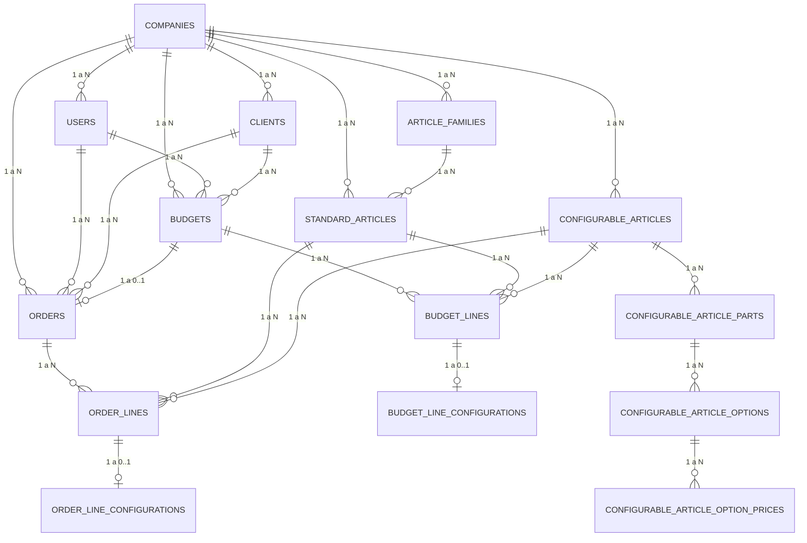

# DER con Tablas y Dibujo - MetricGatesApp

Documento visual para exponer el modelo entidad-relacion en clase.

---

## 1) Tablas principales de la base de datos

| Tabla                              | PK  | FK principales                                                                                                            | Descripcion                                                     |
| ---------------------------------- | --- | ------------------------------------------------------------------------------------------------------------------------- | --------------------------------------------------------------- |
| companies                          | id  | -                                                                                                                         | Empresas del sistema (multiempresa).                            |
| users                              | id  | company_id -> companies.id                                                                                                | Usuarios con roles: super_admin, admin, commercial, technician. |
| clients                            | id  | company_id -> companies.id                                                                                                | Clientes de cada empresa.                                       |
| article_families                   | id  | company_id -> companies.id                                                                                                | Familias de articulos por empresa.                              |
| standard_articles                  | id  | company_id -> companies.id, family_id -> article_families.id                                                              | Catalogo de articulos estandar.                                 |
| configurable_articles              | id  | company_id -> companies.id                                                                                                | Articulos con calculo configurable.                             |
| configurable_article_parts         | id  | configurable_article_id -> configurable_articles.id                                                                       | Partes del articulo configurable.                               |
| configurable_article_options       | id  | part_id -> configurable_article_parts.id                                                                                  | Opciones por cada parte (color, tipo, etc.).                    |
| configurable_article_option_prices | id  | company_id -> companies.id, configurable_article_option_id -> configurable_article_options.id                             | Override de precio por empresa.                                 |
| budgets                            | id  | company_id -> companies.id, client_id -> clients.id, created_by_user_id -> users.id                                       | Cabecera de presupuesto.                                        |
| budget_lines                       | id  | budget_id -> budgets.id, standard_article_id -> standard_articles.id, configurable_article_id -> configurable_articles.id | Lineas de presupuesto.                                          |
| budget_line_configurations         | id  | budget_line_id -> budget_lines.id                                                                                         | Medidas y opciones tecnicas de linea configurable.              |
| orders                             | id  | company_id -> companies.id, budget_id -> budgets.id, client_id -> clients.id, created_by_user_id -> users.id              | Pedido generado desde presupuesto aceptado.                     |
| order_lines                        | id  | order_id -> orders.id, standard_article_id -> standard_articles.id, configurable_article_id -> configurable_articles.id   | Lineas del pedido.                                              |
| order_line_configurations          | id  | order_line_id -> order_lines.id                                                                                           | Configuracion tecnica de cada linea configurable del pedido.    |

---

## 2) Atributos clave por entidad

| Entidad               | Atributos clave                                                   |
| --------------------- | ----------------------------------------------------------------- |
| companies             | fiscal_name, cif_nif, email, active, max_users                    |
| users                 | name, email, dni, role, active                                    |
| clients               | client_number, nombre, telefono, email, active                    |
| standard_articles     | code, name, base_price, tax_percentage, active                    |
| configurable_articles | code, name, tax_percentage, active                                |
| budgets               | budget_number, budget_date, status, base_amount, total_amount     |
| budget_lines          | article_type, quantity, unit_price, discount_amount, total_amount |
| orders                | order_number, order_date, status, total_amount                    |
| order_lines           | article_type, quantity, unit_price, total_amount                  |

---

## 3) Dibujo DER simplificado (con cardinalidades)

---

## 4) Lectura rapida para explicarlo en clase

1. La tabla central del sistema es companies: todo cuelga de la empresa.
2. La operacion comercial se apoya en clients, articles, budgets y orders.
3. budgets es el paso previo a orders: un presupuesto aceptado puede generar un pedido.
4. Para productos tecnicos, se usan tablas configurables (parts/options/configurations).
5. Las cardinalidades 1:N dominan el modelo; las relaciones 1:0..1 aparecen en configuraciones y conversion presupuesto->pedido.

---

## 5) Nota de alcance

Este documento es una version simplificada para presentacion.
El detalle completo de atributos y reglas se encuentra en el archivo [DIAGRAMA_ENTIDAD_RELACION_BD.md](DIAGRAMA_ENTIDAD_RELACION_BD.md).
