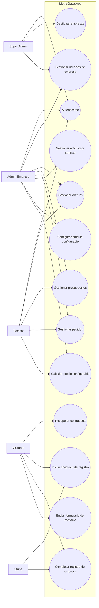
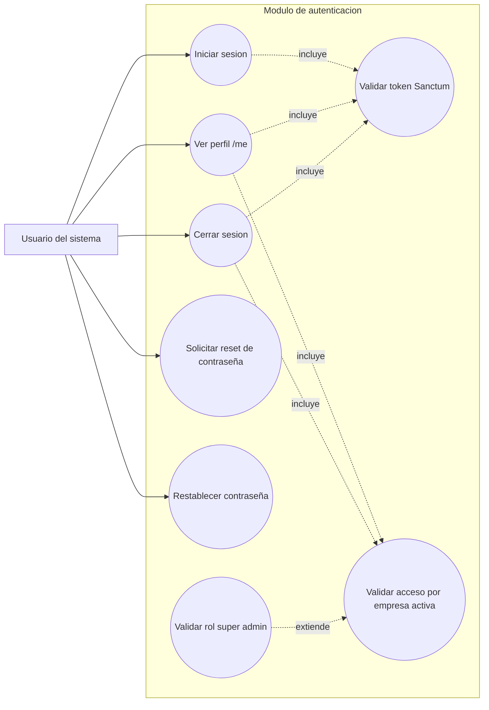
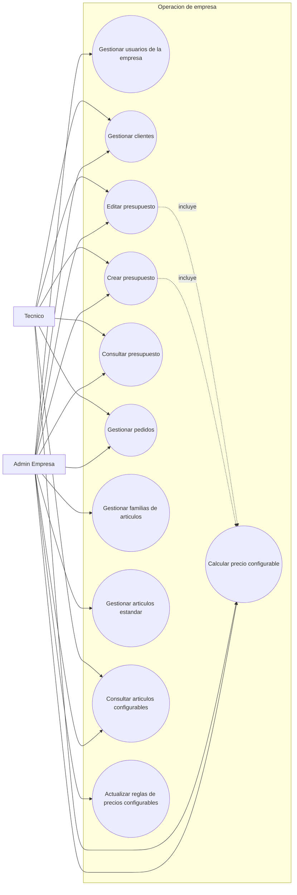
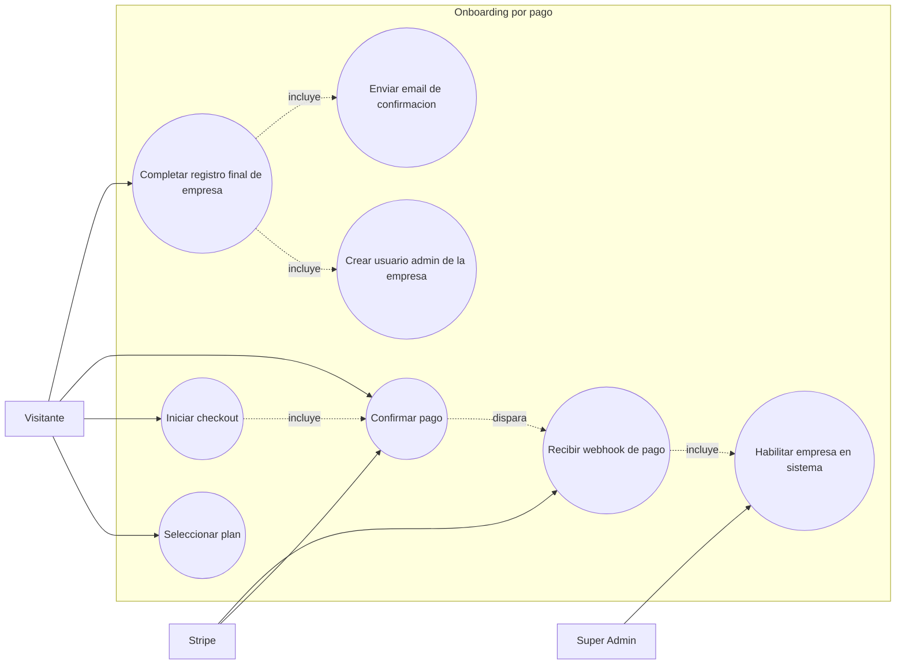

# MetricGatesApp - Diagramas de Caso de Uso

Este documento contiene diagramas de caso de uso (formato Mermaid) listos para explicar el sistema en clase.

---

## 1) Diagrama general del sistema

---

## 2) Caso de uso: Autenticacion y control de acceso

---

## 3) Caso de uso: Operacion interna por empresa

---

## 4) Caso de uso: Alta de empresa con Stripe

---

## 5) Matriz actor -> casos de uso (resumen para exponer)

| Actor            | Casos de uso clave                                                                     |
| ---------------- | -------------------------------------------------------------------------------------- |
| Visitante        | Contacto, recuperar contraseña, iniciar checkout, completar registro                   |
| Admin Empresa    | Gestionar usuarios, clientes, presupuestos, pedidos, articulos y precios configurables |
| Tecnico          | Operacion diaria: clientes, presupuestos, pedidos, calculo configurable                |
| Super Admin      | Gestion global de empresas y control de altas/bajas                                    |
| Stripe (externo) | Confirmacion de pagos y webhook para activar flujo de registro                         |

---

## 6) Como presentarlo al profesor (guion rapido)

1. Empezar por el diagrama general para mostrar vision global de actores.
2. Pasar a autenticacion para justificar seguridad (token + middleware + roles).
3. Explicar operacion por empresa (modulo principal del negocio).
4. Cerrar con Stripe para destacar integracion externa y automatizacion del alta.
5. Usar la matriz final como resumen ejecutivo de 1 minuto.
