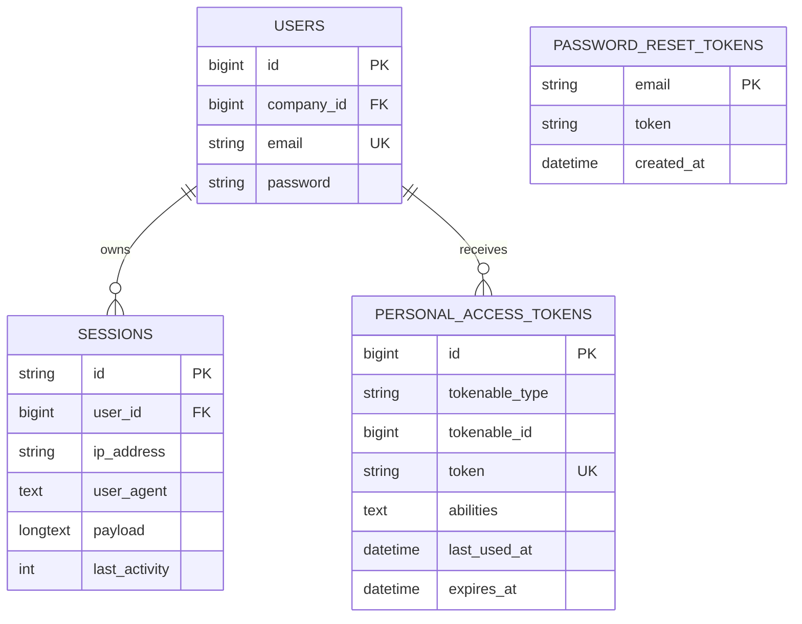

# Diagrama Entidad-Relacion (DER) - Base de datos MetricGatesApp

Este documento resume el modelo de datos real definido en las migraciones de Laravel.
Incluye:

- Entidades
- Atributos principales
- Cardinalidades
- Explicacion funcional de cada bloque

---

## 1) DER principal (negocio)

```mermaid
erDiagram
    COMPANIES {
        bigint id PK
        string fiscal_name
        string commercial_name
        string cif_nif UK
        string email
        string address
        string phone
        string phone2
        string city
        string province
        string postal_code
        string logo
        boolean active
        int max_users
        datetime created_at
        datetime updated_at
    }

    USERS {
        bigint id PK
        bigint company_id FK
        string name
        string email UK
        string dni UK
        string phone
        string address
        string city
        string province
        string avatar
        string role
        boolean active
        datetime email_verified_at
        string password
        datetime created_at
        datetime updated_at
    }

    CLIENTS {
        bigint id PK
        bigint company_id FK
        string client_number
        string dni
        string nombre
        string direccion
        string poblacion
        string codigo_postal
        string provincia
        string telefono
        string telefono2
        string email
        boolean active
        datetime created_at
        datetime updated_at
    }

    ARTICLE_FAMILIES {
        bigint id PK
        bigint company_id FK
        string name
        text description
        boolean active
        datetime created_at
        datetime updated_at
    }

    STANDARD_ARTICLES {
        bigint id PK
        bigint company_id FK
        bigint family_id FK
        string code
        string name
        text description
        string image
        decimal base_price
        decimal tax_percentage
        boolean active
        datetime created_at
        datetime updated_at
    }

    CONFIGURABLE_ARTICLES {
        bigint id PK
        bigint company_id FK
        string code
        string name
        text description
        decimal tax_percentage
        decimal max_hojas_weight_kg
        boolean active
        datetime created_at
        datetime updated_at
    }

    CONFIGURABLE_ARTICLE_PARTS {
        bigint id PK
        bigint configurable_article_id FK
        string key
        string name
        string unit
        int order
        datetime created_at
        datetime updated_at
    }

    CONFIGURABLE_ARTICLE_OPTIONS {
        bigint id PK
        bigint part_id FK
        string key
        string label
        decimal price
        boolean is_default
        datetime created_at
        datetime updated_at
    }

    CONFIGURABLE_ARTICLE_OPTION_PRICES {
        bigint id PK
        bigint company_id FK
        bigint configurable_article_option_id FK
        decimal price
        datetime created_at
        datetime updated_at
    }

    BUDGETS {
        bigint id PK
        bigint company_id FK
        bigint client_id FK
        bigint created_by_user_id FK
        string budget_number
        date budget_date
        string status
        decimal base_amount
        decimal tax_amount
        decimal total_amount
        text notes
        datetime created_at
        datetime updated_at
    }

    BUDGET_LINES {
        bigint id PK
        bigint budget_id FK
        string article_type
        bigint standard_article_id FK
        bigint configurable_article_id FK
        string name
        text description
        decimal quantity
        decimal unit_price
        decimal gross_subtotal
        decimal discount_percentage
        decimal discount_amount
        decimal net_subtotal
        decimal tax_percentage
        decimal tax_amount
        decimal total_amount
        int position
        datetime created_at
        datetime updated_at
    }

    BUDGET_LINE_CONFIGURATIONS {
        bigint id PK
        bigint budget_line_id FK
        decimal ancho_hueco
        decimal alto_hueco
        decimal ancho_obra
        decimal alto_obra
        decimal paso_deseado
        json options_chosen
        json price_breakdown
        json fabrication_measures
        datetime created_at
        datetime updated_at
    }

    ORDERS {
        bigint id PK
        bigint company_id FK
        bigint budget_id FK
        bigint client_id FK
        bigint created_by_user_id FK
        string order_number UK
        date order_date
        date estimated_delivery
        date delivery_date
        string status
        decimal base_amount
        decimal tax_amount
        decimal total_amount
        text notes
        datetime created_at
        datetime updated_at
    }

    ORDER_LINES {
        bigint id PK
        bigint order_id FK
        string article_type
        bigint standard_article_id FK
        bigint configurable_article_id FK
        string name
        text description
        decimal quantity
        decimal unit_price
        decimal gross_subtotal
        decimal discount_percentage
        decimal discount_amount
        decimal net_subtotal
        decimal tax_percentage
        decimal tax_amount
        decimal total_amount
        int position
        datetime created_at
        datetime updated_at
    }

    ORDER_LINE_CONFIGURATIONS {
        bigint id PK
        bigint order_line_id FK
        decimal ancho_hueco
        decimal alto_hueco
        decimal ancho_obra
        decimal alto_obra
        decimal paso_deseado
        json options_chosen
        json price_breakdown
        json fabrication_measures
        datetime created_at
        datetime updated_at
    }

    COMPANIES ||--o{ USERS : has
    COMPANIES ||--o{ CLIENTS : has
    COMPANIES ||--o{ ARTICLE_FAMILIES : has
    COMPANIES ||--o{ STANDARD_ARTICLES : has
    COMPANIES ||--o{ CONFIGURABLE_ARTICLES : has
    COMPANIES ||--o{ BUDGETS : has
    COMPANIES ||--o{ ORDERS : has
    COMPANIES ||--o{ CONFIGURABLE_ARTICLE_OPTION_PRICES : overrides

    ARTICLE_FAMILIES ||--o{ STANDARD_ARTICLES : groups

    CONFIGURABLE_ARTICLES ||--o{ CONFIGURABLE_ARTICLE_PARTS : defines
    CONFIGURABLE_ARTICLE_PARTS ||--o{ CONFIGURABLE_ARTICLE_OPTIONS : contains
    CONFIGURABLE_ARTICLE_OPTIONS ||--o{ CONFIGURABLE_ARTICLE_OPTION_PRICES : has_company_price

    USERS ||--o{ BUDGETS : creates
    USERS ||--o{ ORDERS : creates

    CLIENTS ||--o{ BUDGETS : has
    CLIENTS ||--o{ ORDERS : has

    BUDGETS ||--o{ BUDGET_LINES : contains
    BUDGET_LINES ||--o| BUDGET_LINE_CONFIGURATIONS : config
    STANDARD_ARTICLES ||--o{ BUDGET_LINES : referenced_by
    CONFIGURABLE_ARTICLES ||--o{ BUDGET_LINES : referenced_by

    BUDGETS ||--o| ORDERS : can_generate
    ORDERS ||--o{ ORDER_LINES : contains
    ORDER_LINES ||--o| ORDER_LINE_CONFIGURATIONS : config
    STANDARD_ARTICLES ||--o{ ORDER_LINES : referenced_by
    CONFIGURABLE_ARTICLES ||--o{ ORDER_LINES : referenced_by
```

---

## 2) DER de soporte (autenticacion y sesion)

---

## 3) Cardinalidades clave explicadas

1. Empresa -> Usuarios: 1:N
   Una empresa tiene muchos usuarios; un usuario pertenece a una empresa (o puede ser global si company_id es null en algunos escenarios).

2. Empresa -> Clientes/Articulos/Presupuestos/Pedidos: 1:N
   Cada empresa opera sobre su propio dominio de datos (aislamiento multi-tenant por company_id).

3. Presupuesto -> Lineas: 1:N
   Un presupuesto contiene varias lineas de detalle.

4. Linea de presupuesto -> Configuracion: 1:0..1
   Solo las lineas configurables necesitan una configuracion tecnica (medidas/opciones).

5. Presupuesto -> Pedido: 1:0..1
   Un presupuesto aceptado puede generar como maximo un pedido.

6. Pedido -> Lineas: 1:N
   El pedido replica el detalle operativo desde el presupuesto.

7. Articulo configurable -> Partes -> Opciones: 1:N:N
   Cada articulo configurable define partes, y cada parte ofrece opciones de seleccion.

8. Opcion configurable -> Precio por empresa: 1:N
   Una opcion base puede tener precio especifico por empresa en la tabla de overrides.

---

## 4) Reglas de integridad importantes

- Cascada de borrado en entidades hijas de empresa (usuarios, clientes, articulos, presupuestos, pedidos).
- En presupuestos, client_id y created_by_user_id admiten null si se elimina el padre (nullOnDelete).
- Unicidad por empresa en codigos y numeraciones:
  - clients: (company_id, client_number)
  - clients: (company_id, dni)
  - article_families: (company_id, name)
  - standard_articles: (company_id, code)
  - configurable_articles: (company_id, code)
  - budgets: (company_id, budget_number)
  - configurable_article_option_prices: (company_id, configurable_article_option_id)

---

## 5) Lectura funcional del modelo

- El nucleo de negocio esta centrado en COMPANY.
- Desde COMPANY se derivan usuarios, clientes y catalogo de articulos.
- Con esos datos se construyen BUDGETS y BUDGET_LINES.
- Si el presupuesto se acepta, se transforma en ORDER con sus ORDER_LINES.
- Para articulos configurables, las tablas de PARTS/OPTIONS y CONFIGURATIONS permiten calculo tecnico y trazabilidad de medidas.
- Las tablas de autenticacion (tokens/sessions/reset) separan seguridad de la logica de negocio.

---

Documento preparado para defensa academica: muestra estructura, integridad relacional y flujo operativo de extremo a extremo.
